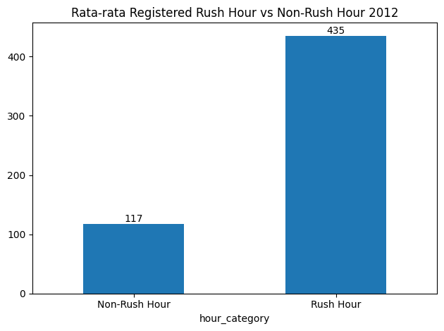

# 🚲 Bike Sharing Analytics Dashboard

## Project Overview

Proyek ini bertujuan untuk menganalisis pola penggunaan layanan bike sharing berdasarkan faktor waktu, musim, kondisi cuaca, dan karakteristik pengguna.

Analisis dilakukan menggunakan pendekatan Exploratory Data Analysis (EDA), kemudian hasil analisis divisualisasikan melalui dashboard interaktif menggunakan Streamlit.

Project ini dibuat sebagai bagian dari submission kelas **Belajar Analisis Data dengan Python** di Dicoding.


## Business Questions

### 1. Rush Hour

Berapa persentase perbedaan rata-rata pengguna `registered` pada jam sibuk dibandingkan jam biasa pada hari kerja selama tahun 2012?

### 2. Pengaruh Cuaca

Bagaimana pengaruh kondisi cuaca terhadap rata-rata jumlah penyewaan sepeda pada musim dingin (winter) selama tahun 2011–2012?


## Dataset

| Variabel | Deskripsi |
|---|---|
| `dteday` | Tanggal |
| `hr` | Jam |
| `season` | Musim |
| `workingday` | Status hari kerja |
| `weathersit` | Kondisi cuaca |
| `temp` | Suhu |
| `hum` | Kelembapan |
| `windspeed` | Kecepatan angin |
| `casual` | Jumlah pengguna casual |
| `registered` | Jumlah pengguna registered |
| `cnt` | Total penyewaan |


## Data Understanding

Dataset digunakan untuk memahami pola penyewaan sepeda berdasarkan waktu, kondisi lingkungan, dan karakteristik pengguna.

Beberapa variabel utama yang menjadi fokus analisis adalah:

- `registered`
- `casual`
- `cnt`
- `season`
- `weathersit`
- `workingday`
- `hr`


## Data Cleaning

Sebelum dilakukan analisis, dilakukan beberapa proses data cleaning, antara lain:

- Memeriksa menghapus kolom instant
- Menyesuaikan tipe data
- Melakukan transformasi variabel kategorikal
- Menangani nilai kelembapan yang bernilai 0


## Exploratory Data Analysis

### Business Question 1 — Rush Hour

Analisis dilakukan dengan memfilter data tahun 2012 dan hari kerja.

Jam sibuk didefinisikan sebagai:

- 07:00–09:00
- 16:00–19:00

Kemudian dibandingkan rata-rata pengguna `registered`
antara Rush Hour dan Non-Rush Hour.



**Hasil Analisis**

Rata-rata pengguna registered pada Rush Hour adalah 435.492529
sedangkan pada Non-Rush Hour adalah 117.099668

Dengan demikian, rata-rata pengguna registered pada Rush Hour lebih tinggi sebesar **271.90%** dibandingkan Non-Rush Hour.


## Key Findings

### 🚦 Rush Hour

Penggunaan sepeda oleh pengguna registered meningkat secara signifikan pada jam sibuk hari kerja. Hal ini menunjukkan bahwa layanan bike sharing memiliki peran penting dalam aktivitas perjalanan rutin atau commuting.

### 🌧️ Weather

Jumlah penyewaan menurun ketika kondisi cuaca memburuk. Hal ini menunjukkan bahwa kondisi cuaca merupakan salah satu faktor yang dapat memengaruhi permintaan layanan.

### 🚲 Casual User

Pengguna casual menunjukkan pola penggunaan yang lebih kuat pada periode tertentu, terutama yang berkaitan dengan aktivitas rekreasi.


## Interactive Dashboard

Hasil analisis kemudian dikembangkan menjadi dashboard interaktif menggunakan Streamlit.

Dashboard menyediakan fitur:

- Filter tahun
- Filter musim
- Filter kondisi cuaca
- Filter jenis hari
- Total penyewaan
- Rata-rata penyewaan
- Registered user
- Casual user
- Tren penyewaan
- Penyewaan berdasarkan jam
- Penyewaan berdasarkan musim
- Analisis Rush Hour


## Tools & Technologies

- Python
- Pandas
- NumPy
- Matplotlib
- Seaborn
- Plotly
- Streamlit
- colab
- Git & GitHub


## Project Structure

```text
bike-sharing-dashboard/
│
├── dashboard/
│   ├── dashboard.py
│   ├── hour_bersih.csv
│   ├── requirements.txt
│   │
│   └── assets/
│       └── logo.png
│
├── notebook/
│   └── bike_sharing_analysis.ipynb
│
├── images/
│   ├── rush_hour.png
│   ├── weather.png
│   └── seasonal.png
│
└── README.md
```


# 11. Installation & Setup

```markdown
## Installation & Setup

### 1. Clone Repository

```bash
git clone <repository-url>
cd bike-sharing-dashboard
```


# 12. How to Run

```markdown
## How to Run

Jalankan dashboard menggunakan:

```bash
streamlit run dashboard.py
```


---

# 13. Recommendations

```markdown
## Recommendations

Berdasarkan hasil analisis, beberapa rekomendasi yang dapat
dipertimbangkan adalah:

1. Optimalisasi layanan pada jam sibuk

   Meningkatkan ketersediaan sepeda pada periode Rush Hour
   untuk mengantisipasi tingginya permintaan pengguna registered.

2. Strategi saat kondisi cuaca buruk

   Menyusun strategi promosi atau layanan tambahan pada kondisi
   cuaca yang menyebabkan penurunan jumlah penyewaan.

3. Strategi untuk pengguna casual

   Mengembangkan promosi yang ditujukan kepada pengguna casual
   pada periode dengan aktivitas rekreasi yang tinggi.
```

## Author

**Septa Bagas Setyawan**

Coding Camp - Data Science

[LinkedIn](https://www.linkedin.com/in/septabagass/)
[GitHub](https://github.com/septabagass)
